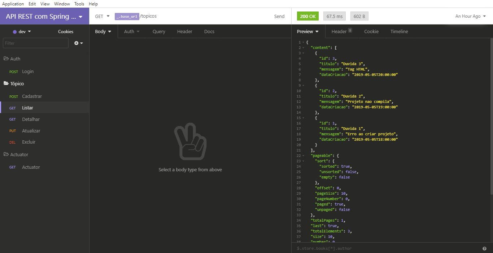

<h1 align="center">
  
</h1>

<h3 align="center">Curso de Spring Boot API REST: Construa uma API / Segurança da API, Cache e Monitoramento</h3>

<p align="center">Desenvolvimento de uma API REST para o fórum da alura com Spring Boot</p>

<p align="center">Por Rodrigo Ferreira - Alura</p>

<p align="center">
  <a href="#como-executar-o-projeto">Como executar o projeto</a>&nbsp;&nbsp;&nbsp;|&nbsp;&nbsp;&nbsp;
  <a href="#configurações-de-ferramentas">Configurações de Ferramentas</a>&nbsp;&nbsp;&nbsp;|&nbsp;&nbsp;&nbsp;
  <a href="#conteúdo-do-curso">Conteúdo do curso</a>
</p>

<p align="center">Back-end</p>

<p align="center">
  
</p>

## Como executar o projeto

### Requisitos

- [Java SDK 11](https://www.oracle.com/java/technologies/javase-jdk11-downloads.html) ou versões posteriores
- [Eclipse](https://www.eclipse.org/downloads/packages), [IntelliJ IDEA](https://www.jetbrains.com/pt-br/idea/) ou [Marven](https://maven.apache.org)

### Opcional

- [Insomnia](https://insomnia.rest)

### Passos para a configuração

**1. Clonar este repositório**

```bash
git clone https://github.com/eliasmcastro/alura-spring-boot-api-rest
```

**2. Banco de bados**

O banco de dados utilizado na aplicação foi o h2 (banco de dados em mémoria)

Para acessar o banco de dados

- URL: http://localhost:8080/h2-console
- Driver Class: org.h2.Driver
- JBC URL: jdbc:h2:mem:alura-forum
- Usuario: sa
- Senha: sa

**3. Executar aplicação**

Se for executar pelo Eclipse

- Abrir o Eclipse -> File -> Import -> Existing Marven Projects (clicar em Next) -> Selecionar a pasta forum do projeto (clicar em Finish)

- Executar ForumApplication.java (src/io.github.eliasmcastro.forum) para iniciar a aplicação

O processo para executar pelo IntelliJ IDEA será semelhante

Se for executar com o Maven

- Entrar na pasta forum (pelo cmd/terminal)
- Executar o comando abaixo para iniciar a aplicação

```bash
mvn spring-boot:run
```

O aplicativo começará a ser executado em http://localhost:8080

_Dica: utilizar o Insomnia para testar as rotas_

- Abrir o Insomnia -> Application -> Preferences -> Data -> Import Data -> From File -> Selecionar o arquivo insomnia.json que está na pasta forum

## Configurações de Ferramentas

### [Java SDK 11](https://www.oracle.com/java/technologies/javase-jdk11-downloads.html) no Windows

- Efetuar o download do executável de acordo com o seu sistema operacional
- _Obs: será necessário realizar um login (criar uma conta caso não possuir) para baixar_
- Realizar a instalação
- Configuar o caminho da instalação do Java nas variáveis de ambiente do Windows de acordo com esse [tutorial](https://medium.com/@mauriciogeneroso/configurando-java-4-como-configurar-as-vari%C3%A1veis-java-home-path-e-classpath-no-windows-46040950638f)

### [Eclipse](https://www.eclipse.org/downloads/packages)

- Efetuar o download do Eclipse. Recomenda-se utilizar a versão (package) Eclipse IDE for Enterprise Java Developers
- Extrair o zip para uma pasta em seu computador

### [Marven](https://maven.apache.org)

- Realizar a instação e configuração do marven conforme esse [tutorial](https://www.devmedia.com.br/introducao-ao-maven/25128#2)

### [Insomnia](https://insomnia.rest)

- O Insomnia serve para testar a API
- Efetuar o download e realizar a instalação

### Start Spring

- Este site [https://start.spring.io](https://start.spring.io/) ajuda na criação de um novo projeto Spring Boot

## Conteúdo do Curso

### Curso de Spring Boot API REST: Construa uma API

Crie aplicações Java com o Spring Boot, configure sua aplicação Spring sem o uso de arquivos XML, acelere o desenvolvimento web com ajuda do Spring Devtools, aprenda o estilo arquitetural REST e use o Spring Data e Bean Validation

- Introdução ao Spring Boot
- Publicando Endpoints
- Usando Spring Data
- Trabalhando com POST
- Validação com Bean Validation
- Métodos PUT, DELETE e tratamento de erro

### Curso de Spring Boot API Rest: Segurança da API, Cache e Monitoramento

Pagine e ordene os resultados da API, melhore o desempenho com Spring Cache, protega a API com Spring Security e JWT, monitore os endpoints com Spring Boot Actuator e Admin e documente a API com Swagger

- Paginação e Ordenação de recursos
- Melhorando desempenho com Spring Cache
- Proteção com Spring Security
- Gerando Token com JWT
- Autenticação via Token
- Monitoramento com Spring Boot Actuator e Admin
- Documentação da API com Swagger
